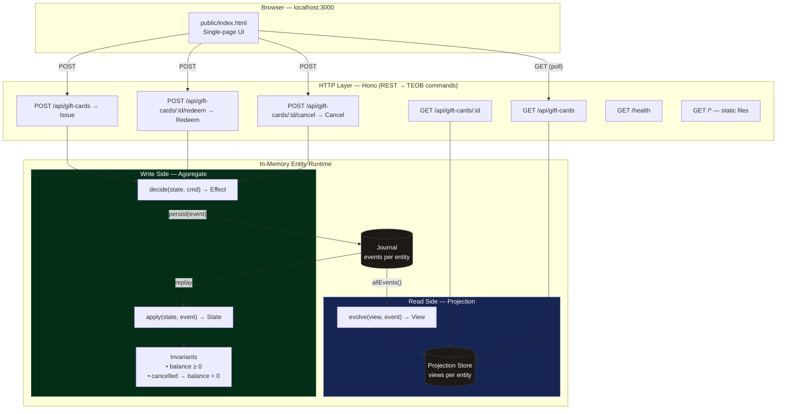
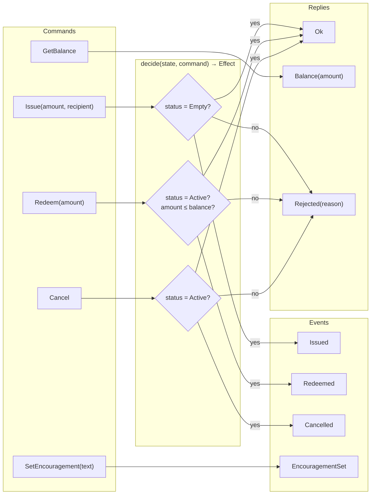
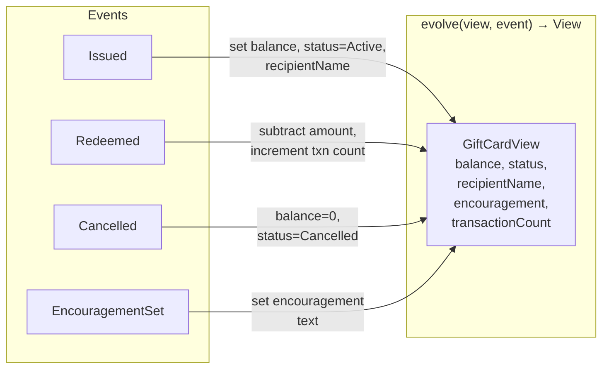
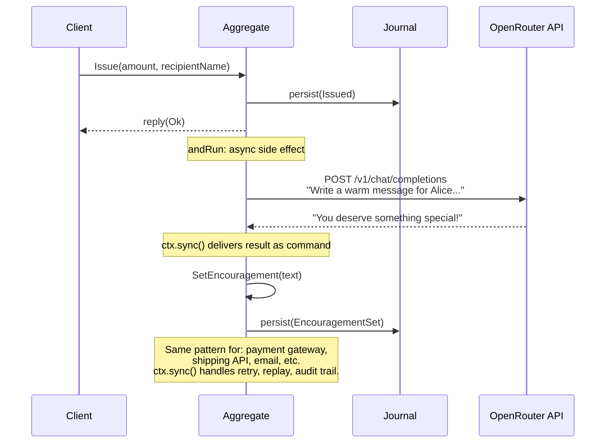

# Architecture — Gift Card Service

A complete event-sourced backend service built with TEOB, Hono, and TypeScript.
Three pure functions define the entire domain. The framework handles HTTP routing,
event persistence, concurrency control, and external service integration.

## The Full Picture



## Write Side — Aggregate (Exercise 1)



## Read Side — Projection (Exercise 2)



## LLM Integration (Demo)



## API Reference (see `openapi.yaml`)

The HTTP surface is a clean REST API. Internally, each endpoint maps to a TEOB command.

| Endpoint                             | Method | TEOB Command    | Request Body                          | Response            |
|--------------------------------------|--------|-----------------|---------------------------------------|---------------------|
| `/api/gift-cards`                    | POST   | Issue           | `{"id","amount","recipientName"}`     | 201 GiftCardView    |
| `/api/gift-cards`                    | GET    | —               | —                                     | 200 GiftCardView[]  |
| `/api/gift-cards/:cardId`            | GET    | — (projection)  | —                                     | 200 GiftCardView    |
| `/api/gift-cards/:cardId/redeem`     | POST   | Redeem          | `{"amount"}`                          | 200 GiftCardView    |
| `/api/gift-cards/:cardId/cancel`     | POST   | Cancel          | —                                     | 200 GiftCardView    |
| `/health`                            | GET    | —               | —                                     | 200 `{"status":"ok"}` |

Commands are an **internal** concept — the REST surface doesn't expose them.
All write endpoints return the updated view, so the client never needs a separate read after a mutation.

## Service Wiring

```typescript
// Runtime + journal
const { runtime, journal } = createInMemoryRuntime([
  registration(giftCardAggregate, giftCardEventCodec, giftCardStateCodec),
]);
const projectionStore = createInMemoryProjectionStore();

// REST → TEOB command mapping
app.post("/api/gift-cards", async (c) => {
  const { id, amount, recipientName } = await c.req.json();
  const result = await runtime.ask(EntityId(id),
    { tag: "Issue", amount, recipientName }, giftCardCategory);
  // ... map result to REST response
});

app.post("/api/gift-cards/:cardId/redeem", async (c) => {
  const { amount } = await c.req.json();
  const result = await runtime.ask(EntityId(c.req.param("cardId")),
    { tag: "Redeem", amount }, giftCardCategory);
  // ...
});
```

The REST layer is a thin mapping. Domain logic stays in pure functions.
The OpenAPI spec (`openapi.yaml`) is the contract — use it to generate clients or frontends.
