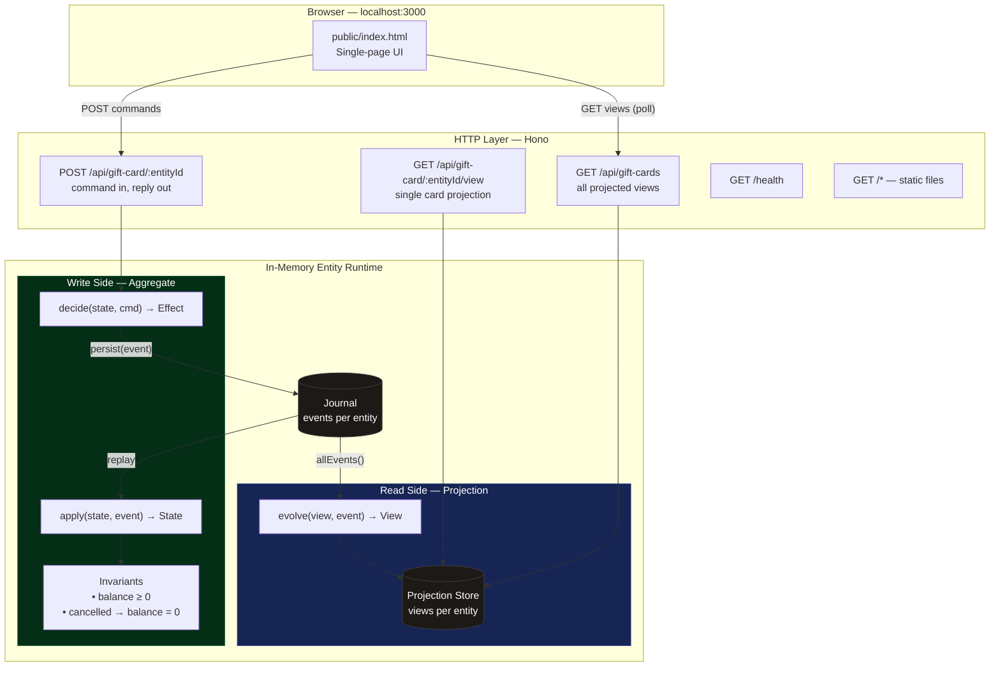
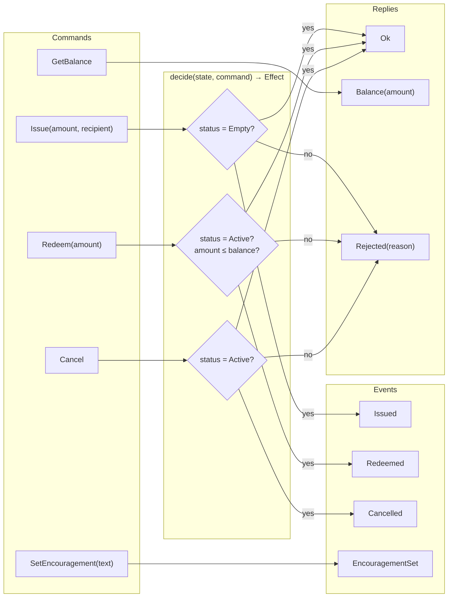
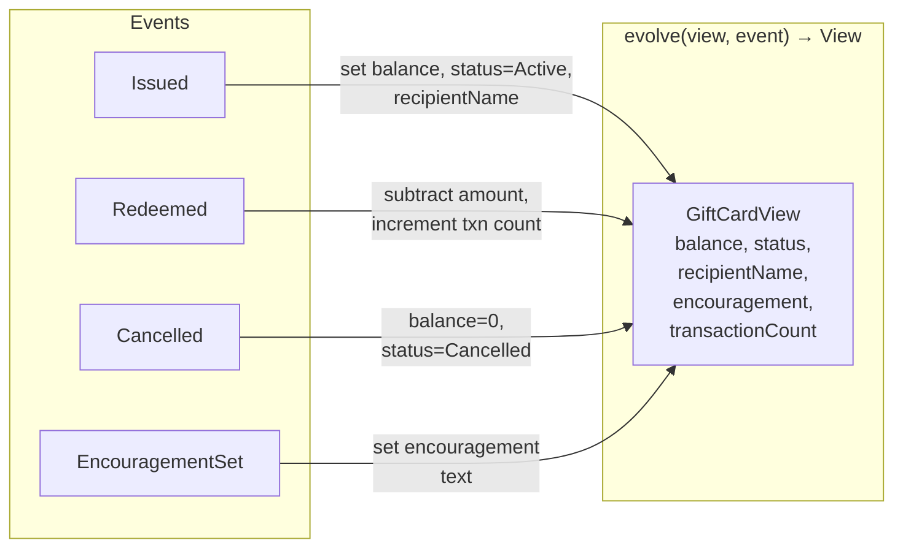
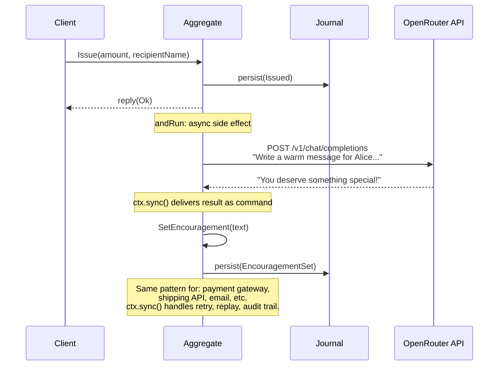

# Architecture — Gift Card Service

A complete event-sourced backend service built with TEOB, Hono, and TypeScript.
Three pure functions define the entire domain. The framework handles HTTP routing,
event persistence, concurrency control, and external service integration.

## The Full Picture



## Write Side — Aggregate (Exercise 1)



## Read Side — Projection (Exercise 2)



## LLM Integration (Demo)



## API Reference

### Write Side — Commands

```
POST /api/gift-card/:entityId
Content-Type: application/json
```

| Command          | Request Body                                            | Success (200)                  | Rejection (400)                   |
|------------------|---------------------------------------------------------|--------------------------------|-----------------------------------|
| Issue            | `{"tag":"Issue","amount":100,"recipientName":"Alice"}`  | `{"tag":"Ok"}`                 | `Card already issued`             |
| GetBalance       | `{"tag":"GetBalance"}`                                  | `{"tag":"Balance","amount":N}` | —                                 |
| Redeem           | `{"tag":"Redeem","amount":30}`                          | `{"tag":"Ok"}`                 | `Not active` / `Insufficient balance` |
| Cancel           | `{"tag":"Cancel"}`                                      | `{"tag":"Ok"}`                 | `Not active`                      |
| SetEncouragement | `{"tag":"SetEncouragement","text":"..."}`                | `200` (no reply body)          | —                                 |

All responses include an `ETag` header for optimistic concurrency.
Send `If-Match: <etag>` on subsequent commands to detect conflicts (409).

### Read Side — Projections

```
GET /api/gift-card/:entityId/view
```

Returns the projected view for one card:
```json
{ "balance": 70, "status": "Active", "recipientName": "Alice", "transactionCount": 1 }
```

```
GET /api/gift-cards
```

Returns all projected views:
```json
[{ "id": "card-1", "balance": 70, "status": "Active", "recipientName": "Alice", "transactionCount": 1 }]
```

## Service Wiring

```typescript
// Runtime + journal
const { runtime, journal } = createInMemoryRuntime([
  registration(giftCardAggregate, giftCardEventCodec, giftCardStateCodec),
]);

// Projection store
const projectionStore = createInMemoryProjectionStore();

// HTTP
const app = new Hono();
app.route("/api/gift-card", aggregateRoutes(runtime, giftCardCategory));

app.get("/api/gift-card/:entityId/view", (c) => {
  runProjection(giftCardProjection, journal, projectionStore, { eventCodec: giftCardEventCodec });
  const envelope = projectionStore.get("gift-card-view", c.req.param("entityId"));
  return envelope ? c.json(envelope.view) : c.json({ error: "Not found" }, 404);
});

app.get("/api/gift-cards", (c) => {
  runProjection(giftCardProjection, journal, projectionStore, { eventCodec: giftCardEventCodec });
  return c.json(projectionStore.list("gift-card-view").map(e => ({ id: e.viewId, ...e.view })));
});

// Static frontend
app.use("/*", serveStatic({ root: "./public" }));
```

Three pure functions → full-stack service. Write side, read side, UI, external integrations.
